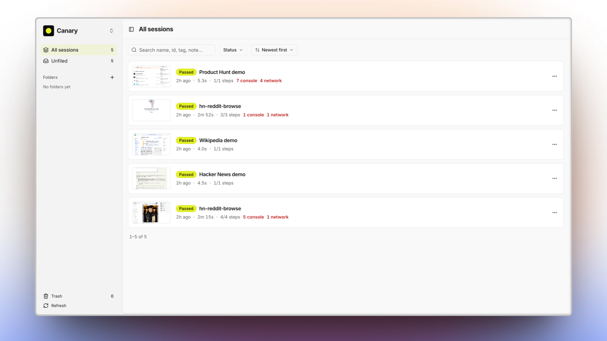
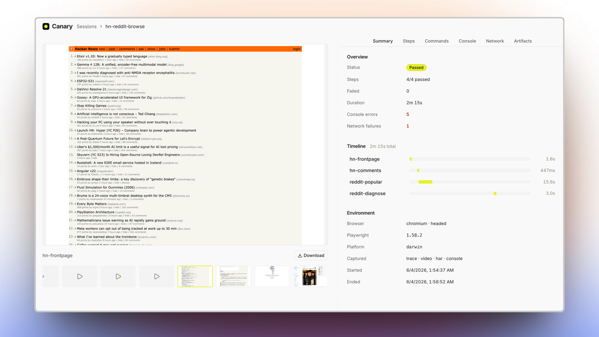
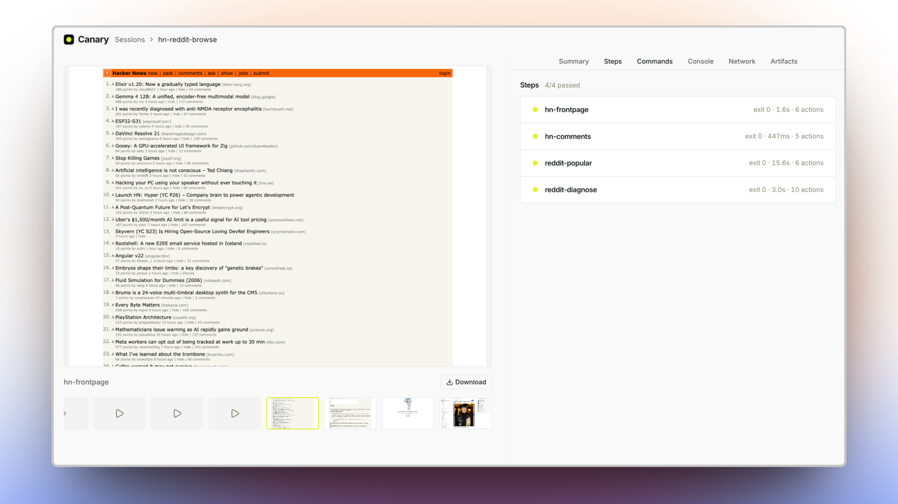
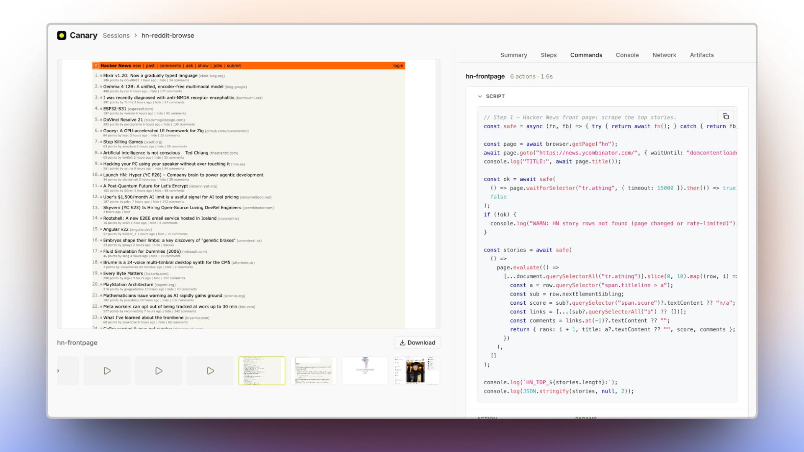
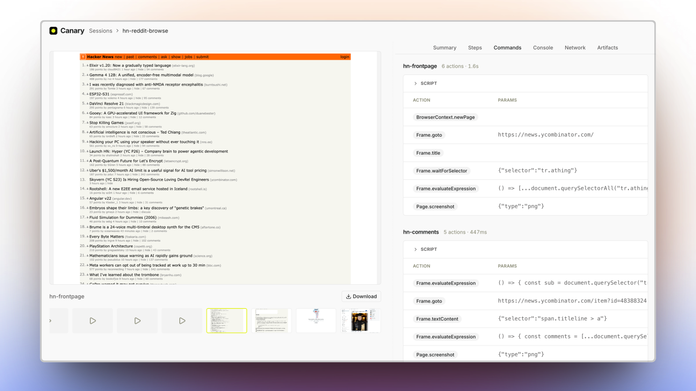
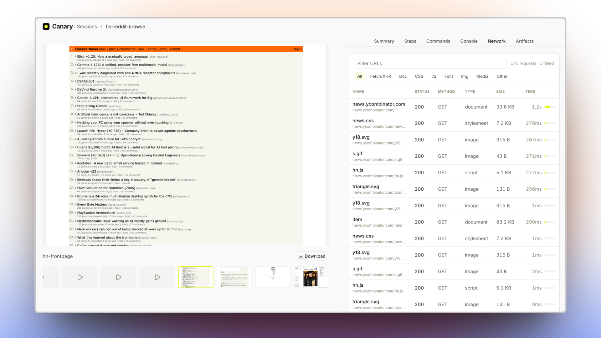

# Canary

**Browser QA for AI agents.** Let your agent drive a real browser — and see exactly what it did.

Canary runs sandboxed JavaScript against real Chromium and records the entire session: the Playwright
trace, a video, every network request, the console, and a screenshot of each step. You get back a
self-contained report you can replay and share — and the exact script the agent ran, ready to run
again. No instrumentation, no guesswork.

- **See exactly what happened.** Trace, video, network, console, and a screenshot of every step — captured automatically.
- **Reproducible by default.** Canary turns each run into a real Playwright script. Let your agent discover a flow once; re-run it forever.
- **One file, zero setup.** Every session is a self-contained `report.html` — open it, commit it, send it. No server, no build.
- **Built for agents.** Drop-in plugins for Claude Code, Cursor, and Codex, or a generic [Agent Skills](https://agentskills.io) pack for everything else.
- **Sandboxed.** Scripts run in a QuickJS WASM sandbox with the full Playwright `Page` API — no Node, no host access.

## See it

Every run lands in a local app — search it, tag it, organize it into folders, replay it:



## Who it's for

You describe the flow in plain language; your agent drives a real browser and hands back **both** a
report you can just read **and** the exact Playwright script — plus the full trace — behind it. Most
tools make you pick one: an opaque agent run you can't reproduce, or raw Playwright you write and
maintain by hand. Canary gives you both.

| You are a…        | Instead of…                                            | Canary gives you…                                                                       |
| ----------------- | ------------------------------------------------------ | --------------------------------------------------------------------------------------- |
| **Developer**     | Writing and maintaining Playwright/E2E scripts by hand | A reusable script captured from every run — re-run it in CI, no agent cost on replay    |
| **QA engineer**   | Clicking through flows manually to repro and verify    | Evidence by default — trace, video, network, console, and a screenshot of every step    |
| **PM / reviewer** | Waiting on a build or trusting "works on my machine"   | A self-contained `report.html` you open and read — every step, replayable and shareable |

## Get started

```bash
npm i -g @usecanary/cli @usecanary/ui   # puts `canary` + `canary-viewer` on your PATH
canary install                          # one-time: Chromium + the runtime into ~/.canary (~150 MB)
```

…or run the guided wizard, which offers to install all of the above for you:

```bash
npm create canary@latest                # guided setup (Ink wizard)
```

Record a session and open the report:

```bash
id=$(canary session start --name "checkout")
canary run ./open.js   --session "$id" --step open
canary run ./submit.js --session "$id" --step submit
canary session end "$id"                # -> ~/.canary/sessions/<id>/report.html

canary-viewer                           # browse every recorded session
canary stop                             # shut the background daemon down when you're done
```

Just need a quick one-off with no recording? Drive the browser engine directly:

```bash
echo 'const p = await browser.getPage("main");
await p.goto("https://example.com");
console.log(await p.title());' | canary-browser
```

Or attach to a Chrome you already have open — launch it with `--remote-debugging-port=9222`, then
`canary-browser --connect` (it auto-discovers the port, or pass the URL explicitly). Handy for driving
a browser that's already logged in:

```bash
canary-browser --connect http://localhost:9222 <<'EOF'
const page = await browser.getPage("main");
console.log(await page.title());
EOF
```

> Prefer not to install? Every command also runs one-off via npx, e.g.
> `npx @usecanary/cli session start …` and `npx @usecanary/ui`.

## Everything your agent does, on the record

Open any session and Canary replays the whole thing — the page, the script, every Playwright call, the
console, the network, the full trace. Nothing summarized, nothing reconstructed: it's the actual run.
(Every screenshot below is real output.) Capture is on by default; switch any stream off with
`--no-trace` / `--no-video` / `--no-har` / `--no-console`.

### The session at a glance

Status, a per-step timeline, the exact environment, and a full **video replay** of the run with a
filmstrip of per-step screenshots — scrub straight to the moment something happened.



### Step by step

Each step, pass or fail, with its exit code, duration, and how many Playwright actions it ran.



### Reproducible Playwright scripts

This is the one that matters. Let your agent figure a flow out **once** — Canary keeps the script
behind every step **and** decodes the full Playwright trace into the exact calls it made (`goto`,
`waitForSelector`, `evaluate`, `screenshot`), with params and timing. What you get back is a real,
reusable script. Next time you don't pay an agent to rediscover the page — you just re-run it.





### Console and page errors

Every console message and uncaught page error, filterable by level — errors, warnings, info, logs —
with the source URL. Errors flagged in red.


### Network, request by request

Every request with status, type, size, and timing. Filter by kind, then click any row to inspect its
headers, payload, and response — like a devtools network panel, frozen at the moment it ran.



### The full trace, and every artifact

The raw Playwright `trace.zip`, the network HAR, the console log, the machine-readable `results.json`,
and the self-contained `report.html` — all under `~/.canary/sessions/<id>/`, all one click away. Open
the trace in Playwright's own viewer with `npx playwright show-trace`.


## Claude Code, natively

In [Claude Code](https://claude.com/claude-code), Canary is a first-class plugin — skills, subagents,
and `/canary:*` slash commands. Tell Claude what you changed or what to check; it plans the QA, drives
a real browser, and hands back the report.

```
/canary:verify    # what changed? → a prioritized QA plan, then record it
/canary:session   # record a flow end to end and render report.html
/canary:run       # drive the browser once, nothing recorded
/canary:review    # open the viewer and triage a recorded session
```

Or skip the slash and just say *"QA the checkout flow and give me a report"* — Canary's subagents pick
it up. Install the plugin below.

## Use it with your coding agent

Canary is built for agents — and it explains itself to them. Install it, then **tell your agent to run
`canary --help`** (or `canary-browser --help` for one-offs): each output is a complete, self-contained
usage guide — sandbox API, worked examples, a Playwright cheat sheet — written for an LLM to read.
No plugin required.

For deeper integration (slash commands, subagents, and skills), install the plugin pack. Canary ships
as a Claude Code plugin, a Cursor plugin, a Codex plugin, and a generic
[Agent Skills](https://agentskills.io) pack — all pointing at the same `skills/` + `agents/` +
`commands/`. There's no bespoke installer; each agent's own mechanism does the work.

```bash
# Claude Code
/plugin marketplace add usecanary/canary
/plugin install canary@canary-marketplace

# Cursor — install "canary" from the Marketplace, or symlink for local dev:
ln -sfn "$(pwd)" ~/.cursor/plugins/local/canary

# Codex
codex marketplace add usecanary/canary        # then /plugins → install "canary"

# Any Agent Skills tool (Windsurf, Codex, …) — skills only:
npx skills add usecanary/canary

# Claude Code, manual (skills only, no plugin):
cp -r skills/* ~/.claude/skills/
```

You get **`canary-scripting`** (the sandbox API, with `references/REFERENCE.md`) plus the workflow
skills **`canary-verify`**, **`canary-automate`**, **`canary-session`**, and **`canary-review`** —
each paired with a subagent and a slash command: `/canary:verify`, `/canary:run`, `/canary:session`,
`/canary:review`.

## Three tools, one runtime

| Tool                            | Command                            | Use it to                                                                          |
| ------------------------------- | ---------------------------------- | ---------------------------------------------------------------------------------- |
| **CLI** `@usecanary/cli`        | `canary`                           | Record capture-enabled QA sessions and render reports. The main, user-facing tool. |
| **Engine** `@usecanary/browser` | `canary-browser`                   | Drive a browser for quick, one-off automation — no recording, no report.           |
| **Viewer** `@usecanary/ui`      | `canary-viewer` · `npx @usecanary/ui` | Browse, search, organize, and replay every recorded session locally.            |

Both CLIs share one background daemon (Playwright + a QuickJS sandbox) that starts automatically when
needed. Stop it anytime with **`canary stop`** (alias: `canary daemon stop`, or `canary-browser stop`) —
it shuts down every browser and session it's running. You can also pass `--stop-daemon` to
`canary session end` to tear it down as soon as nothing else needs it.

## Scripting

Scripts are plain async JavaScript with top-level `await`.

<!-- canary:snippet api-sandbox-env -->
Scripts execute inside a QuickJS WASM sandbox with no arbitrary access to the host system.
This is NOT Node.js — there is no module system and no Node API:

- `require()` / `import()` — no module loading; inline any helpers in the script
- `process`, `fs` / `path` / `os` — no process or direct filesystem access (use the file helpers)
- `fetch` / `WebSocket` — no direct network access (the page does the networking)
- `__dirname` / `__filename` — no path globals

Memory and CPU limits are enforced, and both CPU time and wall-clock time are bounded — infinite
loops or never-settling promises abort the script. Values crossing `evaluate` / `$eval` must be
JSON-serializable.
<!-- canary:end api-sandbox-env -->

<!-- canary:snippet ex-quickstart fenced=js -->
```js
const page = await browser.getPage("main");          // named, persistent page
await page.goto("https://example.com", { waitUntil: "domcontentloaded" });
console.log(await page.title());

const headings = await page.evaluate(() =>
  [...document.querySelectorAll("h1, h2")].map((h) => h.textContent.trim())
);
console.log(JSON.stringify(headings));

await page.locator("a.more").click();
const buf = await page.screenshot({ fullPage: false });
await saveScreenshot(buf, "page.png");               // saveScreenshot(buffer, name)
```
<!-- canary:end ex-quickstart -->

**Browser**

<!-- canary:snippet api-browser -->
- `browser.getPage(nameOrId)` — get-or-create a named page, or attach to an existing tab by the
  `id` from `listPages()`. Named pages persist across steps in a session — call with the same
  name to reuse the tab.
- `browser.newPage()` — an anonymous page, auto-closed when the script ends; does not persist.
- `browser.listPages()` — list every open tab: `[{ id, url, title, name }]` (`name` is `null`
  for tabs you never named).
- `browser.closePage(name)` — close and forget a named page.
<!-- canary:end api-browser -->

**Files**

<!-- canary:snippet api-file-helpers -->
All file I/O is async (await it), sandboxed to `~/.canary/tmp/` (no filesystem escape), and
returns the full path to the file:

- `saveScreenshot(buffer, name)` — persist a screenshot buffer; buffer first:
  `const path = await saveScreenshot(await page.screenshot(), "home.png");`
- `writeFile(name, data)` — write a small file (e.g. JSON state):
  `await writeFile("results.json", JSON.stringify(data));`
- `readFile(name)` — read it back (returns the contents as a string):
  `const data = JSON.parse(await readFile("results.json"));`
<!-- canary:end api-file-helpers -->

**Output**

<!-- canary:snippet api-console -->
- `console.log` / `console.info` write to stdout; `console.warn` / `console.error` write to
  stderr. Top-level `console.log` is your script's output channel.
- `console.log` inside `page.evaluate(() => …)` runs in the page and is captured into the
  session's console artifact instead.
<!-- canary:end api-console -->

<!-- canary:snippet api-playwright-note -->
Pages returned by `browser.getPage()` and `browser.newPage()` are full Playwright Page objects —
the same API (`goto`, `click`, `fill`, `locator`, `evaluate`, `getByRole`, `waitForSelector`, …):
https://playwright.dev/docs/api/class-page
<!-- canary:end api-playwright-note -->

For element discovery, `await page.snapshotForAI()` returns an LLM-friendly outline of the page —
the `canary-scripting` skill and its `references/REFERENCE.md` carry the full API.

## Updating

Already installed? Grab the latest CLIs from npm, then refresh the runtime:

```bash
npm i -g @usecanary/cli@latest @usecanary/ui@latest   # update canary + canary-viewer
canary install                                        # refresh the runtime (Chromium + Playwright)
```

`canary install` is safe to re-run — it pulls the browser/runtime versions the new CLI pins. Running
via npx instead of a global install? `npx @usecanary/cli@latest …` always fetches the newest release.

**Agent integrations** update through each agent's own mechanism:

```bash
# Claude Code — refresh the marketplace catalog, then update from /plugin:
/plugin marketplace update canary-marketplace
# or turn on auto-update: /plugin → Marketplaces → canary-marketplace → Enable auto-update
# (third-party marketplaces ship with auto-update OFF)

# Agent Skills CLI (skills.sh) — updates any skill whose upstream content changed:
npx skills check      # what's stale?
npx skills update     # pull the updates

# Cursor / Codex — update "canary" from each marketplace UI.

# Manual copies — re-copy: cp -r skills/* ~/.claude/skills/
```

Claude Code detects plugin updates by comparing manifest **versions** (bumped every release); the
skills CLI detects them by **content hash** (a tree SHA per skill folder in its `skills-lock.json`
— commit that file for project-scoped installs), so any merged change to `skills/` is immediately
update-visible.

## Contributing & development

Canary is a pnpm + Turborepo monorepo: five apps and five packages cooperate to make agent-driven
browser automation reproducible.

<details>
<summary><strong>Repo layout</strong></summary>

```
canary/
├── apps/
│   ├── canary/             # @usecanary/cli      bin: canary          — session orchestrator (record QA sessions, render reports)
│   ├── canary-browser/     # @usecanary/browser  bin: canary-browser  — browser-automation engine (one-off runs)
│   ├── canary-daemon/      # @usecanary/daemon   no bin               — Playwright + QuickJS runtime (embedded into the CLIs)
│   ├── canary-ui/          # @usecanary/ui       bin: canary-viewer   — local session viewer (Astro); `canary-viewer`
│   └── create-canary/      # create-canary    bin: create-canary   — `npm create canary` setup wizard (Ink)
├── packages/
│   ├── protocol/           # @usecanary/protocol         IPC schemas (Zod), single source of truth
│   ├── config/             # @usecanary/config           shared tsconfig bases
│   ├── logger/             # @usecanary/logger           pino-backed structured logger
│   ├── cli-kit/            # @usecanary/cli-kit          shared CLI helpers
│   └── daemon-client/      # @usecanary/daemon-client    daemon transport + lifecycle; embeds the daemon bundle
├── skills/                 # agent skills: canary-scripting (+references), -verify, -automate, -session, -review
├── agents/                 # JTBD subagents: verify-agent, automate-agent, session-agent, review-agent
├── commands/               # slash commands: /canary:verify, :run, :session, :review
├── .claude-plugin/         # Claude Code plugin + marketplace manifests
├── .cursor-plugin/         # Cursor plugin manifest (pairs with rules/)
├── plugins/canary/         # Codex plugin wrapper (.codex-plugin → canonical skills/)
├── .agents/                # Codex / agents marketplace manifest
├── rules/                  # Cursor rules (canary-workflows.mdc)
├── examples/               # dev-only demo scripts (Hacker News, Product Hunt, GitHub Trending, Wikipedia)
└── .github/                # CI
```

`canary` (the orchestrator) and `canary-browser` (the engine) both embed and supervise
`canary-daemon` (the long-running Playwright host). The viewer ships standalone — `canary-viewer`
(or one-off via `npx @usecanary/ui`).

</details>

<details>
<summary><strong>Build, test &amp; conventions</strong></summary>

```bash
make install   # pnpm install across the workspace
make build     # build everything in topo order
make test      # run all tests
make check     # compile + lint + test (what CI runs)
```

Run `make` with no args to see all targets.

- **Conventional Commits** enforced via `commitlint` + a husky `commit-msg` hook.
- **Linting & formatting** via [Ultracite](https://docs.ultracite.ai/) (Biome) — `pnpm lint` checks, `pnpm format` autofixes; pre-commit runs `lint-staged` → `ultracite fix` on staged files.
- **Logging** via `@usecanary/logger` (pino, structured). Set `CANARY_LOG_LEVEL` (trace|debug|info|warn|error|silent); the CLI also accepts `--verbose`/`-v`.
- **Node 20+** and **pnpm 9.15.0** (see `.nvmrc` and `packageManager`).
- **Turbo** orchestrates builds (`turbo run build`, `dev`, `test`, `compile`); lint/format run via Ultracite at the root.

</details>

See [`AGENTS.md`](AGENTS.md) for architecture and orientation, [`CONTRIBUTING.md`](CONTRIBUTING.md)
for the contribution flow, and [`RELEASING.md`](RELEASING.md) for the publish pipeline.

## License

MIT. Canary's daemon and CLIs are derived in part from MIT-licensed work by
[Sawyer Hood](https://github.com/SawyerHood) — see [`LICENSE`](LICENSE).
